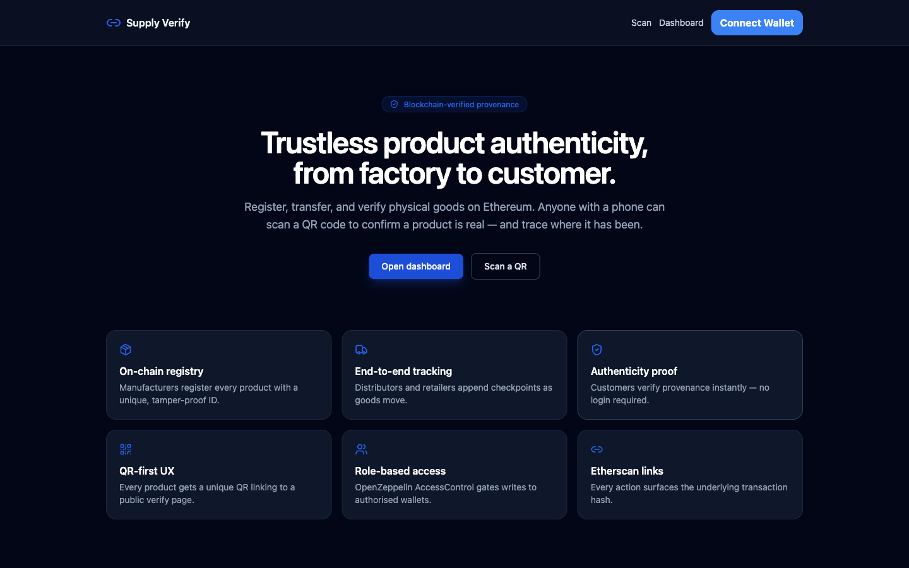

# Supply Chain Product Identification System

**Live demo:** <https://alfredang.github.io/supplyverify/>



Blockchain-backed product authenticity, ownership, and movement tracking. Manufacturers register products on-chain; distributors and retailers append checkpoints; customers verify via QR code without a wallet.

Reference inspiration: <https://github.com/shang-yi-qian/Product-Verify>

## Stack

- **Frontend** — plain HTML, CSS, and vanilla JavaScript. No build step, no bundler, no Node runtime.
  - Tailwind CSS via Play CDN
  - ethers.js v6 (UMD bundle) for all chain calls
  - `qrcode` for QR generation, `html5-qrcode` for camera scanning
  - `lucide` icons
  - MetaMask via `window.ethereum`
- **Smart contract** — Solidity 0.8.24 using OpenZeppelin `AccessControl` + `ReentrancyGuard`. Hardhat is used only for compilation/testing/deployment of the contract; it is not part of the runtime.
- **Network** — Sepolia testnet (chainId 11155111). Hardhat local network supported for development.
- **Hosting** — GitHub Pages, deployed automatically via GitHub Actions on every push to `main` that touches `web-static/`.

## Project layout

```
supplychain/
├── contracts/      # Hardhat project — SupplyChain.sol + tests + deploy script
└── web-static/     # Frontend — pure HTML/CSS/JS (deployed to GitHub Pages)
```

> An alternative Next.js/TypeScript implementation lives in `web/` for reference. It is not part of the live demo.

## 1. Smart contract

```bash
cd contracts
cp .env.example .env          # fill SEPOLIA_RPC_URL, PRIVATE_KEY, ETHERSCAN_API_KEY
npm install
npm run compile
npm test                      # all tests must pass
```

### Local deploy

```bash
npm run node                  # in one terminal: starts hardhat node on :8545
npm run deploy:local          # in another: deploys + prints address
```

### Sepolia deploy

```bash
npm run deploy:sepolia
```

The deployer wallet is granted `DEFAULT_ADMIN_ROLE`. Use the admin page (or `grantRole` directly) to authorise manufacturer / distributor / retailer wallets.

## 2. Frontend

The frontend is plain static files — open them with any HTTP server. The camera QR scanner needs an `http(s)://` origin (it won't work over `file://`).

```bash
cd web-static
python3 -m http.server 3100   # or:  npx serve -l 3100
```

Open <http://localhost:3100>.

### Configure

Edit [`web-static/js/config.js`](web-static/js/config.js) — values are inlined, no `.env`:

```js
window.APP_CONFIG = {
  CHAIN_ID: 11155111,                 // 11155111 Sepolia, 31337 Hardhat local
  CHAIN_NAME: "Sepolia",
  RPC_URL: "https://rpc.sepolia.org",
  CONTRACT_ADDRESS: "0x…",            // paste the deployed SupplyChain address
  WEB3_STORAGE_TOKEN: "",             // optional — empty falls back to mock CIDs
  EXPLORER: "https://sepolia.etherscan.io",
};
```

## 3. Pages

| Page | URL | Purpose |
| --- | --- | --- |
| Landing | `index.html` | Hero + features |
| Connect | `connect.html` | MetaMask connect, role-aware redirect |
| Admin | `admin.html` | Grant manufacturer/distributor/retailer roles |
| Manufacturer | `manufacturer.html` | Role dashboard, totals, quick links |
| Register | `products-new.html` | Form → IPFS → on-chain → QR |
| Product detail | `product.html?id=0x…` | Detail, status update, QR |
| Transfer | `transfer.html?id=0x…` | Transfer ownership |
| Verify (lookup) | `verify.html` | Look up by serial+batch or raw id |
| Public verify | `verify-detail.html?id=0x…` | **No-wallet** authenticity page (QR target) |
| Scan | `scan.html` | Camera-based QR scanner |

Dynamic routes use `?id=…` query strings — no router required.

## 4. Smart contract API

```
registerProduct(bytes32 id, uint64 expiresAt, string metadataCID)   // MANUFACTURER_ROLE
updateStatus(bytes32 id, Status s, string location, string note)    // current owner
transferOwnership(bytes32 id, address to, Status s, string loc)     // current owner
addCheckpoint(bytes32 id, string location, string note)             // current owner
flagSuspicious(bytes32 id)                                          // admin or manufacturer
recall(bytes32 id)                                                  // admin or manufacturer

verify(bytes32 id) → (Product, bool exists)                         // public view
getHistory(bytes32 id) → Checkpoint[]                               // public view
```

`bytes32 id = keccak256(serialNumber + "|" + batchNumber)` — serial+batch must be unique.

Statuses: `Manufactured`, `InWarehouse`, `InTransit`, `ReceivedByDistributor`, `ReceivedByRetailer`, `SoldToCustomer`, `Recalled`, `Suspicious`.

## 5. Deployment

- **Contract** → Sepolia via `npm run deploy:sepolia`. Optional: verify on Etherscan.
- **Frontend** → already deployed. Any push to `main` that changes `web-static/` triggers [`.github/workflows/pages.yml`](.github/workflows/pages.yml), which uploads `web-static/` to GitHub Pages.

To deploy elsewhere (Netlify, Cloudflare Pages, S3, nginx) just point the host at `web-static/` — no build step.

## 6. End-to-end smoke test

1. `cd contracts && npm test` — all green.
2. Deploy to Sepolia, paste the address into `web-static/js/config.js`.
3. Open the live site, connect the admin wallet → `admin.html` → grant `MANUFACTURER_ROLE` to a second wallet.
4. Switch to the manufacturer wallet → `products-new.html` → register a product. The QR + product ID render.
5. Scan the QR with a phone (or open `verify-detail.html?id=…`) → public page loads without a wallet, shows status.
6. From the manufacturer wallet, open `transfer.html?id=…` → transfer to a distributor wallet.
7. Distributor wallet sees the owner controls on the detail page; submit a status update. Reload the public verify page — the new checkpoint appears with an Etherscan-linkable actor.
8. Try updating from a third, unrelated wallet → tx reverts with `not current owner`, UI shows an error toast.

## 7. Security notes

- All on-chain writes are gated by OpenZeppelin `AccessControl` roles or an `onlyOwnerOf(productId)` modifier.
- `nonReentrant` on transfer/status as defensive hardening (no value flows today).
- Inputs are validated client-side and on-chain (`require` statements).
- `.env*` files and `node_modules/` are gitignored. Never commit `PRIVATE_KEY` or any IPFS upload token.

## 8. Future work

- NFT-style certificate of authenticity per product
- CSV batch import for manufacturers
- Multi-chain support (Polygon, Base, Arbitrum)
- Customer ownership claim flow after retail purchase

---

Powered by [Tertiary Infotech Academy Pte Ltd](https://www.tertiarycourses.com.sg/).
